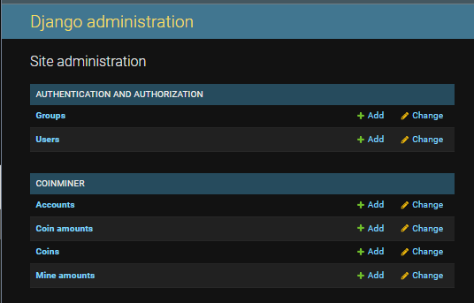
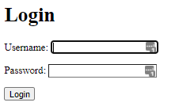
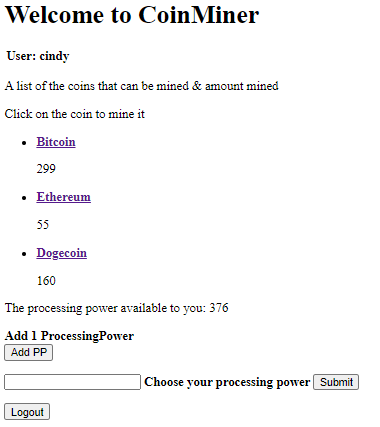
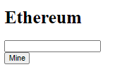
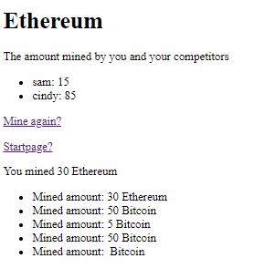
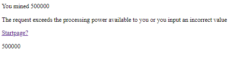
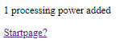

# InsecureCoinSite - CoinMiner

## Cyber Security Base 2021

This website is built as the first Project of the course Cyber Security Base, a course series by University of Helsinki and MOOC.fi in 
collaboration with F-Secure. 

The task is to create a web application that has at least five different cyber security flaws from the OWASP top ten list, either 
from the 2017 or 2021 list. 

[OWASP List](https://owasp.org/www-project-top-ten/) 

[Course Website](https://cybersecuritybase.mooc.fi/) 

## Repository / Webapp Description

For the project I have built a webapp called CoinMiner. It has a very simple game, where users 
1. add processing power to their account 
2. chose a coin which they want to mine (f.ex. Bitcoin)
4. add the amount they whish to mine.
This detracts from their processing power, and they cannot mine more than they have processing power. 
After they have mined a results list is shown of who has the most coins mined.

A note on the webapp: The amount of processing power the users can add to themselves is not limited in any way,
which obviously makes it less playable as an actual game, but I have kept it this way to keep the webapp quite simple. 
Actually, the site is perhaps best seen as a prototype for a simple webapp game. 

The web app is based on Django's starter website tutorial. I created the application from the tutorial and modified it to
become the current website.

The starter website tutorial can be found here [Writing your first Django app](https://docs.djangoproject.com/en/3.1/intro/tutorial01/)

## Install Instructions 

1. Install the dependencies, instructions can be found here [Setup Guide](https://cybersecuritybase.mooc.fi/installation-guide)
   (See sections - Installing Python 3, Installing additional packages)
  
   For installing GIT see [Installing GIT](https://git-scm.com/book/en/v2/Getting-Started-Installing-Git)
   &#9: Type `git --version` to check if Git is installed
   
  
2. Open terminal in the folder for placing the project into
3. Type: `https://github.com/StefanBonney/Cyber-Security-Base_Course-Project_Helsinki-University_2021`

## Getting Started

1. From the clone folder, in terminal move to the folder InsecureCoinSite, which contains the file manage.py
2. Type: `python3 manage.py runserver`
3. Open a browser (f.ex. chorme) and navigate to: `localhost:8000/CoinMiner`
4. This will take you to the login page. There are two normal user profiles provided.

   | Username | Password |
   |:--------:|:--------:|
   | sam      | sam      |
   | cindy    | cindy    |

5. If you want to try the admin panel instead navigate to `localhost:8000/CoinMiner/admin`. 
   The followin admin profile is provided. 

   | Username | Password |
   |:--------:|:--------:|
   | admin    | admin    |

The functionality and purpose of each of the website URLs/pages is decribed below.

## URL / Webapp Page Description

The site contains the following URLs:

`http://localhost:8000/CoinMiner/admin/`
The defult admin panel provided by Django, it allows for things like creating new users and other application objects

  

`http://localhost:8000/CoinMiner/login/`
Login view provided by the Django framework to allow for normal user login

  

`http://localhost:8000/CoinMiner/`
The index/start page of the website. It lists the coins that can be mined and allows for adding processing power.

  

`http://localhost:8000/CoinMiner/1/`
The detail view. 1 can be substituted for any number and represents the coin id passed (f.ex. Bitcoin). 
This page allows to input an amount to be mined of the selected coin. 

  

`http://localhost:8000/CoinMiner/1/results/`
The results page. Once an amount has been mined this page lists all the amounts of this coin, mined by each of the other users.

  

`http://localhost:8000/CoinMiner/1/30/mine/`
The post request from the form in the detail view is sent to this URL. The logic for processing the transaction is completed
there after which a redirect is sent back, directing the browser to the results page.

`http://localhost:8000/CoinMiner/1/error/`
If the user fails to pass in an amount to mine on the detail page or tries to mine an amount that is larger than the processing
power available to him, he is sent to the error page. The page contains a link to the start page.

  

`http://localhost:8000/CoinMiner/1/add/`
The page for adding processing power. If the add PP button is pressed from the startpage the user will be taken to this page.
That button uses the get method. There is also a field for adding a chosen amount of processing power. if the button for that 
field is pressed it sends a POST request to the URL which adds the specified amount of processing power to the users account.   

  

